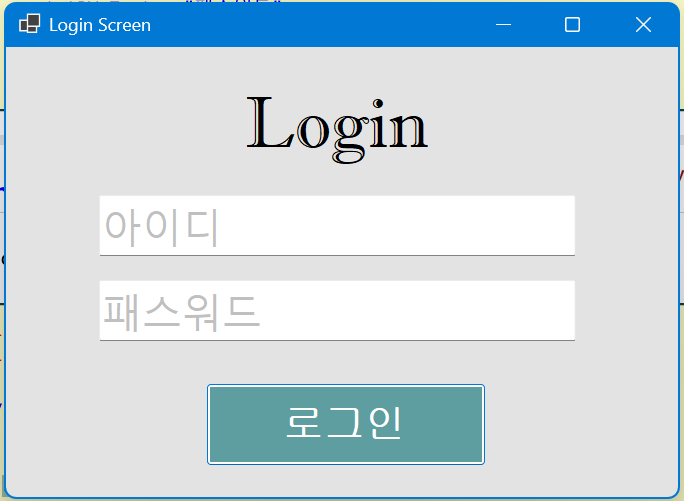

# (C# 코딩) 에코 메신저

## 개요
- C# 프로그래밍 학습
- 1줄 소개: 사용자가 텍스트박스에 아이디와 패스워드를 직접 입력하는 로그인창 프로그램
- 사용한 플랫폼:
	- C#, .NET Windows Forms, Visual Studio, Github
- 사용한 컨트롤:
	- label, Textbox, Botton
- 사용한 기술과 구현한 기능
	- Visual Studio를 이용하여 UI 디자인
	- if문과 Enter 이벤트와 Leave 이벤트를 이용해 아이디와 패스워드 텍스트박스에 silver색의 안내 글자 만들기, 탭을 텍스트박스에 놓을 시 그 글자를 사라지게 하기를 구현
	- txtPW.UseSystemPasswordChar의 T/F를 이용해 패스워드 작성 시 다른 사람이 보지 못하도록 글자 비공개처리를 구현
	- myID와 myPW 변수를 설정하고 if문과 else문을 이용해 각 텍스트박스에 올바른 입력 시 "로그인 성공"이라는 메시지박스가, 틀린 입력 시 "로그인 실패" 메시지박스가 나타나도록 구현
	

## 실행 화면 (과제1)
- 과제1 코드의 실행 스크린샷

(img/task1-2.png)(img/task1-3.png)

- 과제 내용
	- 전체적인 UI 설정
	- 각 텍스트박스에 안내용 글자 삽입과 기능 구현
	- 로그인 아이디와 패스워드 설정과 버튼-메시지박스

- 구현 내용과 기능 설명
	- 전체적인 UI를 구성함. 라벨과 form의 이름, 아이디와 패스워드를 위한 텍스트박스, 로그인 버튼을 만듦.
	- 각 텍스트박스의 Enter 이벤트와 Leave 이벤트에 if문을 이용해 처음 상태에 "아이디"와 "패스워드"가 안내되어 표시되도록 함. 그리고 그 안내는 마우스 클릭이나 탭으로 이동하면 사라지고 사용자가 직접 입력 가능하도록 함. 다시 텍스트박스에 비어있다면 그 안내가 표시되도록 함.
	- 아이디와 패스워드를 설정하고 '로그인'버튼 click 이벤트에 txtPW.UseSystemPasswordChar을 이용해 사용자가 옳은 입력을 했는지 판단하도록 구현함. 옳으면 "로그인 성공"이라는 메시지박스가, 틀리면 "로그인 실패"메시지박스가 뜨도록 함.
